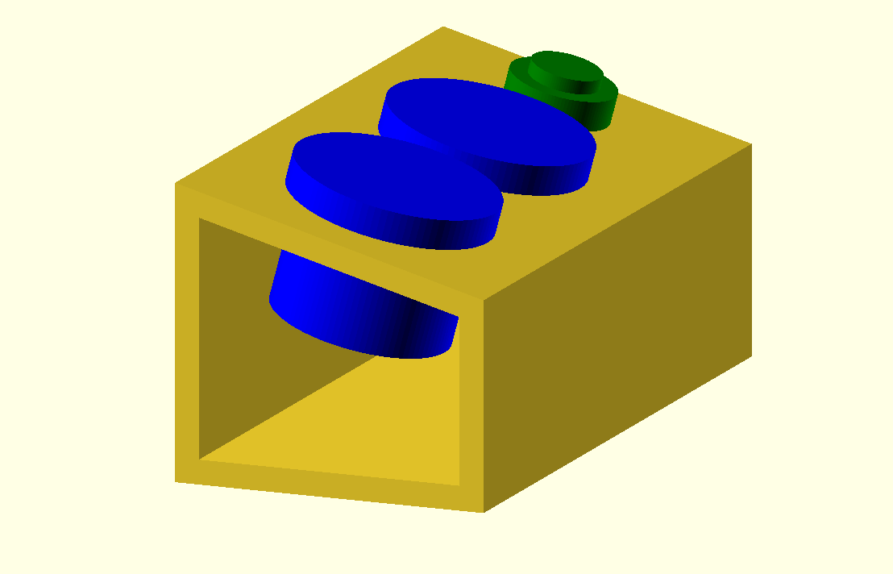

# Macro Keyboard

A custom macro keyboard, with two buttons and a toggle switch.

## Features

- Teensy LC microcontroller
- 3D-printed enclosure, designed in OpenSCAD
- 2 arcade buttons
- 1 large illuminated toggle switch

Also, note the awesome slanted design to the panel, inspired by synthesizers.

## How the switch works:

- Setup
  - Connect GROUND to Teensy ground
  - Connect POWER to Teensy 3v
- Use
  - When the switch is on, the internal LED will light up
  - When the switch is on, POWER and ACC will be connected
