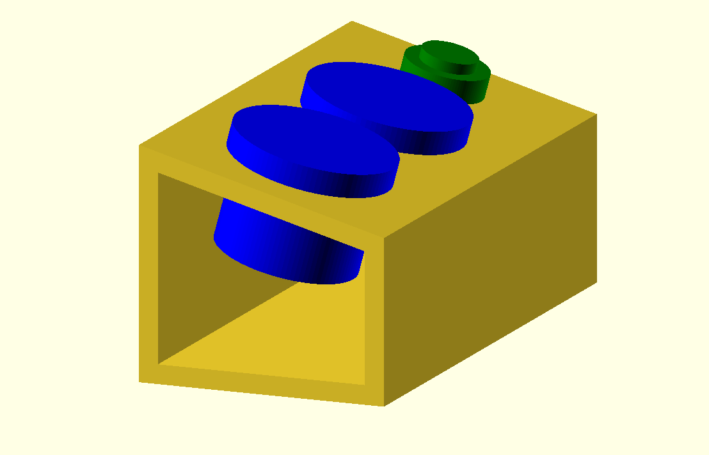

# Macro Keyboard

A custom macro keyboard with two buttons.

## Features

- Teensy LC microcontroller
- 3D-printed enclosure, designed in OpenSCAD
- 2 arcade buttons

Also, note the awesome slanted design to the panel, inspired by synthesizers.
